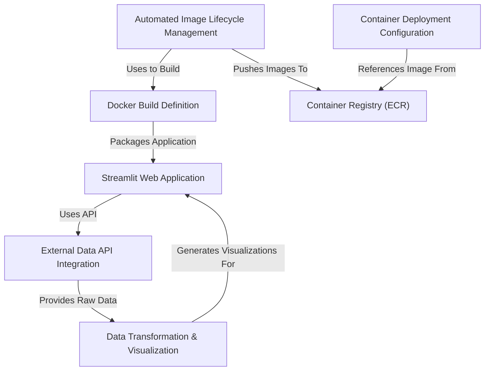
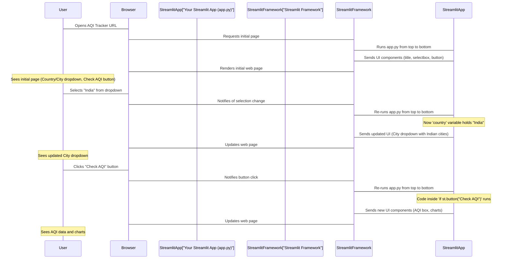
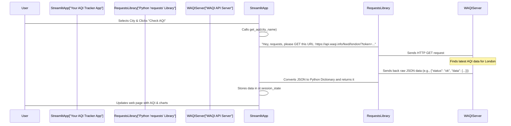
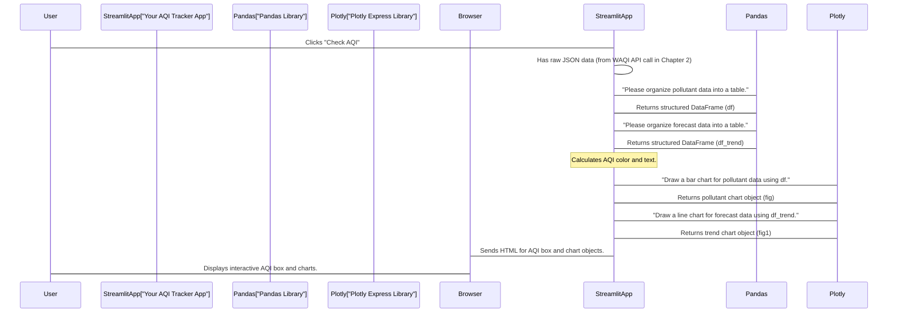
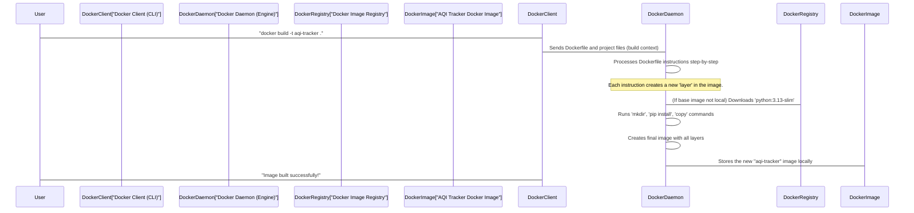
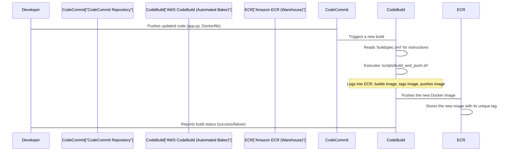
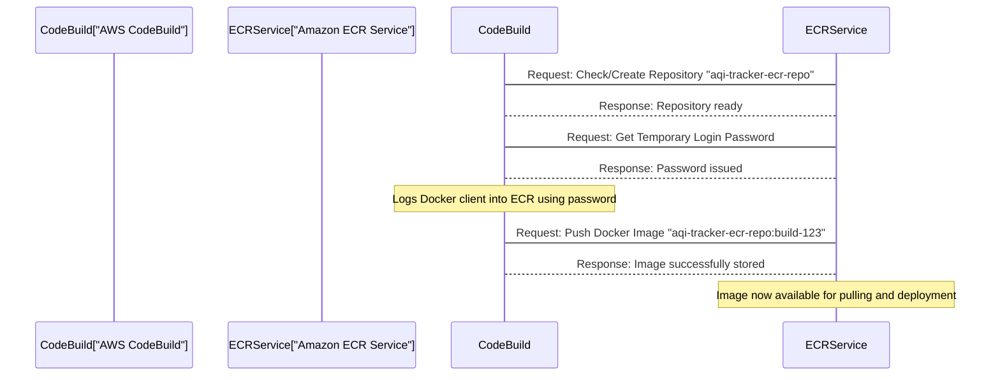
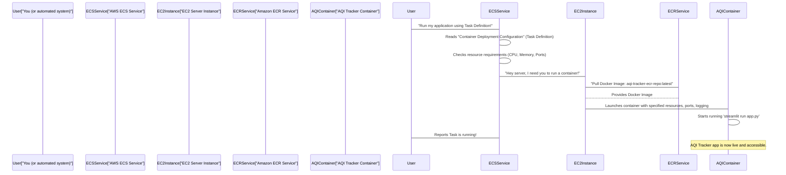

# Tutorial: AQI-Tracker

The AQI-Tracker project is an *interactive web application* built with Streamlit that allows users to **monitor real-time air quality** for various cities globally. It fetches air quality data from an *external API*, processes it, and then presents it through **dynamic and color-coded visualizations** to help users easily understand pollution levels and trends.


## Visual Overview



## Chapters

1. [Streamlit Web Application
](01_streamlit_web_application_.md)
2. [External Data API Integration
](02_external_data_api_integration_.md)
3. [Data Transformation & Visualization
](03_data_transformation___visualization_.md)
4. [Docker Build Definition
](04_docker_build_definition_.md)
5. [Automated Image Lifecycle Management
](05_automated_image_lifecycle_management_.md)
6. [Container Registry (ECR)
](06_container_registry__ecr__.md)
7. [Container Deployment Configuration
](07_container_deployment_configuration_.md)

# Chapter 1: Streamlit Web Application


The first thing you see and interact with in our AQI Tracker project is its friendly web interface. This interface, where you select cities and see air quality data, is what we call the "Streamlit Web Application."

### What is a Web Application?

Imagine you want to check the weather. You probably open a browser (like Chrome or Firefox), go to a website (like Google Weather), type in your city, and see the temperature and forecast. That website is a **web application**. It's a program that lives on the internet and allows you to interact with it using your web browser.

Our AQI Tracker is also a web application. Instead of weather, it helps you track Air Quality Index (AQI) for different cities. Think of it as the car's dashboard and controls – it's what you see and use to "drive" (or in this case, track AQI), presenting all relevant information in an easy-to-understand way.

### The Challenge: Building Web Apps Can Be Hard!

Traditionally, building web applications can be quite complex. You might need to know several different programming languages and technologies (like HTML for structure, CSS for styling, JavaScript for interactivity, and a backend language like Python or Java). It’s like needing to be an expert carpenter, painter, and electrician just to build a simple shed!

### The Solution: Streamlit Makes It Easy (Especially for Python Users!)

This is where **Streamlit** comes in! Streamlit is a fantastic tool that lets you build beautiful, interactive web applications purely using Python. If you know Python, you can build a web app without needing to learn HTML, CSS, or JavaScript. It handles all the complicated web stuff behind the scenes, allowing you to focus on your data and what you want to show users.

For our AQI Tracker, Streamlit is the magic that turns Python code into an interactive website.

### How Our AQI Tracker Uses Streamlit: A Simple Tour

Let's look at how Streamlit helps us create parts of our AQI Tracker application. When you open `app.py` (our main application file), the first few lines tell Streamlit how to set up the page and what title to display.

```python
import streamlit as st

# Configure the page settings
st.set_page_config(
    page_title="AQI Tracker", # What appears in the browser tab
    page_icon="🌍",           # The little icon in the browser tab
    layout="centered",        # How the content is arranged on the page
)

# Display the main title and a description on the web page
st.title("🌍 Air Quality Index (AQI) Tracker")
st.write("Track AQI of any city in the world using free WAQI API.")
```

**What's happening here?**
*   `import streamlit as st`: This line is like saying "I want to use all the cool tools Streamlit provides, and I'll refer to them as `st` for short."
*   `st.set_page_config(...)`: This sets up basic properties for your web page, like its title in the browser tab and a small icon.
*   `st.title(...)`: This displays a big, prominent title at the top of your web page.
*   `st.write(...)`: This is a very versatile command that can display almost anything on your web page, like simple text or numbers.

These few lines already create the top part of our web application, making it easy to see what the app is about.

### Getting User Input: Making It Interactive

A web application isn't much fun if you can't interact with it! Streamlit provides various "widgets" that allow users to input information or make choices. In our AQI Tracker, we need to let users select a country and a city.

```python
# ... (previous code for imports and page config) ...

# Allow the user to select a country from a dropdown list
country = st.selectbox(
    "Select Country",
    ["India", "United States", "United Kingdom"] # Example countries
)

# Allow the user to select a city based on the chosen country (simplified for example)
city = st.selectbox(
    "Select City",
    ["Delhi", "Mumbai"] # Example cities if "India" was selected
)

# Create a button that the user can click
if st.button("Check AQI"):
    # This code runs only AFTER the "Check AQI" button is clicked
    st.write(f"You want to check AQI for: {city} in {country}.")
```

**What's happening here?**
*   `st.selectbox(...)`: This creates a dropdown menu. The user sees a list of options and can pick one. Streamlit then stores their choice in the `country` or `city` variable.
*   `st.button(...)`: This creates a clickable button. When the user clicks it, the code inside the `if st.button(...)` block gets executed. In our full app, this is where we'd fetch the actual AQI data!

These interactive elements are crucial for a useful web application, and Streamlit makes them incredibly simple to add.

### Displaying Results: Showing the AQI

Once the user provides input (like selecting a city and clicking "Check AQI"), our app needs to display the air quality information. Streamlit provides easy ways to show text, numbers, and even fancy charts.

For example, to display the AQI value with a special color:

```python
# ... (previous code for imports, page config, and input widgets) ...

# Imagine 'aqi' variable holds the AQI number (e.g., 75)
aqi = 75
aqi_color = "yellow"     # Determined by the AQI value, e.g., using a function
aqi_text = "Moderate 🙂" # Category label for the AQI value

# Display the AQI value in a specially styled box using Markdown and HTML
st.markdown(
    f"""
    <div style="padding:20px; border-radius:10px; background:{aqi_color}; color:white; text-align:center;">
        <h1 style="margin:0;">AQI: {aqi}</h1>
        <p style="margin:0; font-size:20px; font-weight:bold;">{aqi_text}</p>
    </div>
    """,
    unsafe_allow_html=True, # Allows us to embed custom HTML
)
```

**What's happening here?**
*   `st.markdown(...)`: This command lets you display text using Markdown formatting (like bold text or headings). Crucially, by setting `unsafe_allow_html=True`, we can also embed custom HTML code. This allows us to create the beautiful, color-coded AQI box directly in our Python script!

And to show interactive charts:

```python
# ... (previous code) ...
import pandas as pd
import plotly.express as px

# Create some dummy data for demonstration purposes
data_for_chart = {'Pollutant': ['PM2.5', 'O3', 'NO2'], 'Value': [35, 60, 25]}
df = pd.DataFrame(data_for_chart)

# Create a simple bar chart using the Plotly Express library
fig = px.bar(df, x="Pollutant", y="Value", title="Pollutant Concentrations")

# Display a subheader and then the interactive chart in the Streamlit app
st.subheader("📊 Pollutant Chart")
st.plotly_chart(fig)
```

**What's happening here?**
*   `plotly.express as px`: Plotly Express is a powerful library for creating interactive charts.
*   `px.bar(...)`: This creates a bar chart object using our example data.
*   `st.plotly_chart(fig)`: This is Streamlit's magical command to take a chart created with Plotly (or other charting libraries) and display it directly on your web page, making it interactive!

### How Does Streamlit Work Under the Hood?

When you run a Streamlit application, it's not like a traditional web server that waits for requests. Instead, Streamlit runs your Python script from top to bottom every time a user interacts with the app (like clicking a button or selecting an option).

Let's imagine you're using our AQI Tracker:



This "re-run on interaction" model is what makes Streamlit so powerful and easy to use. You write your Python script almost like a regular script, and Streamlit takes care of making it interactive on the web.

### Looking at `app.py`'s Structure

Our `app.py` file is structured to use Streamlit effectively:

1.  **Imports**: We import `streamlit` and other libraries needed (like `requests` for fetching data, `pandas` for data handling, `plotly.express` for charts).
    ```python
    import streamlit as st
    import requests # For making web requests
    import pandas as pd # For organizing data
    import plotly.express as px # For interactive charts
    ```
    This is where we bring in all the tools our application will use.

2.  **Configuration & Title**: We set up basic page settings and display the main title.
    ```python
    st.set_page_config(page_title="AQI Tracker", page_icon="🌍", layout="centered")
    # ... other code ...
    st.title("🌍 Air Quality Index (AQI) Tracker")
    st.write("Track AQI of any city in the world using free WAQI API.")
    ```
    These lines define the initial look and feel of our web page.

3.  **Input Widgets**: We create dropdowns for country and city selection, and the "Check AQI" button.
    ```python
    # ... other code ...
    # Country dropdown (simplified for example)
    country = st.selectbox("Select Country", ["India", "USA"])
    # City dropdown (simplified for example)
    city = st.selectbox("Select City", ["Delhi", "New York"])

    if st.button("Check AQI"):
        # This is where our app will fetch and process AQI data
        pass # Placeholder for actual data fetching in Chapter 2
    ```
    This section is all about gathering information from the user.

4.  **Displaying Data**: If data has been fetched (after the button click), we display the AQI box and the interactive charts.
    ```python
    # ... other code ...
    # A simplified check if data is ready to display
    if 'some_data_is_available' in st.session_state:
       
        # Display the colorful AQI box using custom HTML
        st.markdown(
            f"""<div style="background:green; color:white;">
                    <h1>AQI: 45</h1><p>Good 😄</p>
                </div>""", unsafe_allow_html=True
        )

        # Example of displaying a chart
        # st.plotly_chart(my_chart_figure)
    ```
    This part is responsible for showing all the results to the user in a clear and engaging way. The `st.session_state` is Streamlit's way to remember data between interactions, which is very useful for dynamic apps.

As you can see, Streamlit allows us to write a Python script that directly translates into a functional, interactive web application, handling all the complex web development details for us.

### Conclusion

In this chapter, we learned that the "Streamlit Web Application" is the user-friendly interface of our AQI Tracker. Streamlit is a powerful Python library that simplifies building interactive web applications by allowing us to use familiar Python code for both logic and presentation. We saw how basic Streamlit commands help us display text, gather user input, and show dynamic results like AQI values and charts.

# Chapter 2: External Data API Integration

Welcome back! In [Chapter 1: Streamlit Web Application](01_streamlit_web_application_.md), we learned how Streamlit helps us build the user-friendly interface of our AQI Tracker. You saw how to create buttons, dropdowns, and display information. But there was one crucial piece missing: **where does the actual air quality data come from?** Our app can look beautiful, but without real, up-to-date data, it's just an empty shell.

This is where "External Data API Integration" comes into play. It's the part of our project that reaches out to the internet, specifically to the WAQI (World Air Quality Index) API, to fetch the real-time air quality data for the cities you select.

### The Problem: Our App Needs Real-Time Data

Imagine you want to know the current AQI for Delhi. Your Streamlit app has a dropdown to select "Delhi" and a "Check AQI" button. When you click that button, your app needs to do two things:

1.  **Find the data**: It needs to know where to go on the internet to get Delhi's AQI.
2.  **Understand the data**: It needs to be able to ask for the data in a way the data source understands, and then read the reply it gets back.

Our app can't magically know the AQI of every city in the world. It needs a reliable source to ask.

### The Solution: Talking to External Services (APIs)

Think of our AQI Tracker application as a person who wants to know the air quality in a distant city. Instead of traveling there themselves, they send a very specific message to a specialized "information center" (the WAQI API). This information center knows all about air quality and can quickly send back the answer.

This act of sending a message and receiving a reply from another program or service over the internet is what "External Data API Integration" is all about.

### Key Concepts

Let's break down the important ideas behind how our app gets its data:

#### 1. What is an API? (Application Programming Interface)

An **API** is like a **menu in a restaurant**. It tells you what dishes (data) you can order and how to order them (what questions you can ask). It's a set of rules and protocols that allows different software applications to communicate with each other.

*   **Our App (Customer)**: Wants to know the AQI for a city.
*   **WAQI API (Restaurant Kitchen)**: Has the air quality data.
*   **API (Menu/Waiter)**: Defines how our app can request data (e.g., "Give me AQI for [city name]").

#### 2. The WAQI API: Our Data Source

We use a specific API called the **WAQI (World Air Quality Index) API**. This is the specialized "information center" that collects and provides air quality data from monitoring stations around the globe. Our app "talks" to this API to get its data.

#### 3. HTTP Requests: Asking for Information

When our app wants data from the WAQI API, it sends an **HTTP request**. HTTP (Hypertext Transfer Protocol) is the language web browsers use to talk to websites. In our case, our Python app acts like a browser, making requests to the WAQI API server.

Most commonly, we'll send a **GET request**, which is like saying, "Please *get* me some information."

#### 4. JSON: The Language of the Reply

When the WAQI API replies with the data, it usually sends it in a format called **JSON** (JavaScript Object Notation). JSON is a very common, easy-to-read way to organize data, similar to how we use dictionaries in Python.

Here's a tiny example of what JSON might look like (simplified):

```json
{
  "status": "ok",
  "data": {
    "aqi": 75,
    "city": {
      "name": "London"
    },
    "iaqi": {
      "pm25": {"v": 40},
      "o3": {"v": 55}
    }
  }
}
```

Our app receives this JSON text and then converts it into a Python dictionary, which is much easier for our Python code to work with.

#### 5. API Token: Your Special Key

To access the WAQI API, you need an **API Token**. This is like a special key or password that identifies your application. It helps the API know who is making the request and sometimes limits how many requests you can make.

In our project, the `TOKEN` variable holds this key:

```python
# --- File: app.py ---
TOKEN = "8d3ef47168669198e75ada3d0ed682e0d169eb85"   # Your WAQI token (example value)
```

**Important**: This `TOKEN` is sensitive information. In a real-world, larger application, you would store this more securely, perhaps as an environment variable, rather than directly in your code. For our tutorial project, having it in `app.py` is fine for simplicity.

### How Our App Uses API Integration

In our `app.py` file, we have a special function called `get_aqi` that handles all the magic of talking to the WAQI API.

Let's look at a simplified version of this function:

```python
# --- File: app.py (simplified) ---
import requests # We need this library to make web requests

TOKEN = "8d3ef47168669198e75ada3d0ed682e0d169eb85" # Our API key

def get_aqi(city_name):
    # 1. Build the specific internet address (URL) for the city
    # Example: "https://api.waqi.info/feed/london/?token=YOUR_TOKEN"
    url = f"https://api.waqi.info/feed/{city_name}/?token={TOKEN}"
    
    # 2. Send a request to that URL and get the raw response
    response_from_web = requests.get(url)
    
    # 3. Take the API's reply (JSON text) and turn it into a Python dictionary
    data_as_python_dictionary = response_from_web.json()
    
    return data_as_python_dictionary

# --- Example of using it (not in app.py directly, but to understand) ---
# If you called get_aqi("london"), it would return a Python dictionary
# raw_london_data = get_aqi("london")
# print(raw_london_data["data"]["aqi"]) # Would print the AQI number for London
```

**What's happening here?**

*   `import requests`: We're bringing in a powerful Python library called `requests`. This library makes it super easy to send HTTP requests and handle their responses.
*   `url = f"..."`: We construct the exact web address (URL) needed to ask the WAQI API for data about a specific `city_name`. Notice how our `TOKEN` is included in the URL – it's like our entry pass!
*   `requests.get(url)`: This is the core command. It tells the `requests` library to send an HTTP GET request to the constructed `url`. It's like sending our "waiter" (the `requests` library) to the "kitchen" (WAQI API) with our order.
*   `.json()`: The `requests` library gets the reply back from the API. This reply is in JSON format. The `.json()` method conveniently converts that JSON text directly into a Python dictionary, which is very easy to work with in our code.

#### Calling `get_aqi` in Our Streamlit App

Now, let's see where this `get_aqi` function is actually used in our `app.py`, connecting it to the [Streamlit Web Application](01_streamlit_web_application_.md) we discussed.

```python
# --- File: app.py (simplified part) ---

# ... (Streamlit configuration, dropdowns for country/city) ...

if st.button("Check AQI"):
    # When the user clicks the "Check AQI" button, this code runs:
    
    # 1. We call our special function to get data from the internet
    raw_api_data = get_aqi(city) # 'city' comes from the Streamlit selectbox
    
    # 2. We check if the API call was successful
    if raw_api_data["status"] == "ok":
        # 3. If it's good, we extract the main AQI value
        aqi_value = raw_api_data["data"]["aqi"]
        
        # 4. We store important parts of the data so Streamlit can display it
        st.session_state.aqi = aqi_value
        st.session_state.details = raw_api_data["data"]
        # ... (other data like pollutant details will be stored too) ...

        st.success(f"Successfully fetched AQI for {city}!")
    else:
        st.error(f"Could not fetch AQI for {city}. Please try another city.")

# ... (Code to display AQI and charts, which will use st.session_state.aqi etc.) ...
```

**What's happening here?**

*   The `if st.button("Check AQI"):` block ensures that the API call only happens when the user actively requests it.
*   `get_aqi(city)`: We pass the `city` name (which the user selected in the Streamlit dropdown) to our `get_aqi` function.
*   `raw_api_data["status"] == "ok"`: After getting the data, we check its `status` field. The API often includes a status to tell us if the request was successful or if there was an error.
*   `raw_api_data["data"]["aqi"]`: If successful, we access specific parts of the Python dictionary (which came from the JSON) to get the actual AQI number.
*   `st.session_state.aqi = aqi_value`: We use `st.session_state` to temporarily save the fetched data. This is crucial in Streamlit because Streamlit re-runs your script from top to bottom on every interaction. `st.session_state` helps remember values between these re-runs, so the data persists after the button click and can be used to display charts.

### Under the Hood: The Request-Reply Dance

Let's visualize the step-by-step process of how our application gets air quality data from the internet.



### Conclusion

In this chapter, we explored the vital concept of "External Data API Integration." We learned that our [Streamlit Web Application](01_streamlit_web_application_.md) needs to talk to external services like the WAQI API to get real-time information. We saw how APIs act like menus, how HTTP requests are used to ask for data, and how JSON is the standardized language for replies. Our `get_aqi` function, powered by the `requests` library, is the core component that fetches this data, making our AQI Tracker truly functional.

# Chapter 3: Data Transformation & Visualization

Welcome back, AQI explorers! In [Chapter 1: Streamlit Web Application](01_streamlit_web_application_.md), we built the friendly face of our AQI Tracker. Then, in [Chapter 2: External Data API Integration](02_external_data_api_integration_.md), we learned how our app fetches real-time air quality information from the WAQI API.

Now, imagine you've just received a big, complex reply from the WAQI API – a bunch of technical numbers and codes. It's like getting a raw list of ingredients for a fancy meal, but you need to serve a delicious, organized dish. This is where "Data Transformation & Visualization" comes in!

### The Problem: Raw Data is Hard to Understand

When our app talks to the WAQI API, it gets back data in a format called JSON. This JSON is very useful for computers, but it's not always easy for humans to read and understand at a glance.

Here's a tiny, simplified piece of raw data our app might get:

```json
{
  "status": "ok",
  "data": {
    "aqi": 75,
    "iaqi": {
      "pm25": {"v": 40},
      "o3": {"v": 55},
      "no2": {"v": 20}
    },
    "city": {"name": "London"}
  }
}
```

If you just saw this, would you immediately know what the air quality is like, or what pollutant is most prevalent? Probably not without some effort.

Our goal is to turn this "ingredient list" into a clear, appealing meal:
1.  **A big, colorful AQI number** with a friendly message.
2.  **Interactive charts** showing pollutant levels and trends over time.

This chapter is all about taking that raw data, cleaning it up, organizing it, and then drawing clear pictures (visualizations) from it so everyone can quickly grasp the air quality information. It's like being both a translator and an artist for our data!

### Key Concepts

Let's break down how we achieve this.

#### 1. What is "Raw Data"?

Raw data is simply the information exactly as we receive it, often directly from a source like an API. It hasn't been processed, cleaned, or formatted for easy understanding yet. Think of it as dirt dug straight from the ground – it might contain valuable minerals, but it's mixed with a lot of other stuff.

#### 2. Data Transformation: Turning Raw into Useful

**Data transformation** is the process of converting raw data into a more suitable and useful format. It's like refining that dirt to extract the pure minerals, or taking our list of ingredients and preparing them (chopping, mixing, cooking) into a meal.

For our AQI Tracker, transformation involves:
*   **Extracting specific pieces**: Finding the overall AQI number, the individual pollutant values (like PM2.5, O3, NO2), and forecast information.
*   **Organizing into tables**: Putting these pieces into structured tables, which in Python are often called **Pandas DataFrames**.

#### 3. Pandas DataFrames: Organized Tables for Data

Imagine you have a messy pile of notes on your desk. It's hard to find anything! Now imagine you organize those notes into a neat table with rows and columns, like a spreadsheet. That's what a **Pandas DataFrame** is for our data.

Pandas is a powerful Python library specifically designed to work with structured data in table-like formats.

| Pollutant | Value |
| :-------- | :---- |
| PM2.5     | 40    |
| O3        | 55    |
| NO2       | 20    |

This table (DataFrame) is much easier to read and use for creating charts than the raw JSON!

#### 4. Data Visualization: Drawing Pictures with Data

**Data visualization** is the art of presenting data in a graphical or pictorial format. Instead of reading numbers, you see bars, lines, or pie slices. Why? Because our brains are incredibly good at understanding patterns and trends from images much faster than from lists of numbers.

It's like telling a story with pictures instead of just words. A picture of a beautiful landscape gives you a better feel for it than a long description.

#### 5. Plotly Express: Making Interactive Charts Easy

To create these beautiful, interactive charts, we use a Python library called **Plotly Express**. It's built on top of the powerful Plotly library and makes creating many common types of charts (like bar charts, line charts, pie charts) incredibly simple, often with just one line of code!

The best part? Streamlit knows how to display Plotly charts perfectly, making them interactive right in our web app.

### How Our App Transforms & Visualizes Data

Let's see how our `app.py` uses these concepts to make sense of the raw AQI data.

First, recall from [Chapter 2: External Data API Integration](02_external_data_api_integration_.md) that when you click "Check AQI", we call `get_aqi(city)` and get back a Python dictionary (which came from the JSON).

```python
# --- From app.py (inside the 'if st.button("Check AQI"):' block) ---
# 'data' holds the raw Python dictionary from the API
# Example: {'status': 'ok', 'data': {'aqi': 75, 'iaqi': {...}}}
data = get_aqi(city)

if data["status"] == "ok":
    details = data["data"] # This extracts the main 'data' part
    aqi = details["aqi"]   # This extracts the overall AQI value

    # ... more transformation code below ...
```

Here, `details` becomes another dictionary containing all the interesting bits like AQI, pollutant breakdown (`iaqi`), and forecast. `aqi` directly gets the main Air Quality Index number.

#### Transforming Pollutant Data into a DataFrame

The `iaqi` part of the data contains information about individual pollutants. It looks something like `{'pm25': {'v': 40}, 'o3': {'v': 55}}`. We need to turn this into a nice table.

```python
# --- From app.py (continuing inside the 'if st.button("Check AQI"):' block) ---
iaqi = details.get("iaqi", {}) # Get individual pollutant data
pollutants = {k: v.get("v") for k, v in iaqi.items()}

# Create a Pandas DataFrame from the pollutants dictionary
df = pd.DataFrame(pollutants.items(), columns=["Pollutant", "Value"])

# Ensure 'Value' is a number and remove any empty rows
df["Value"] = pd.to_numeric(df["Value"], errors="coerce")
df = df.dropna()

# Store this organized data in Streamlit's session state
st.session_state.df = df
```

**What's happening here?**
1.  `iaqi = details.get("iaqi", {})`: We safely grab the `iaqi` dictionary. If it's not there, we get an empty dictionary to avoid errors.
2.  `pollutants = {k: v.get("v") for k, v in iaqi.items()}`: This is a Python dictionary comprehension! It quickly goes through `iaqi` and creates a new dictionary like `{'pm25': 40, 'o3': 55}`. We're extracting just the `v` (value) from each pollutant.
3.  `df = pd.DataFrame(...)`: This is the magic of Pandas! We convert our `pollutants` dictionary directly into a DataFrame with "Pollutant" and "Value" columns.
4.  `df["Value"] = pd.to_numeric(...)`: We make sure the `Value` column contains actual numbers, not text, so we can draw charts correctly. `errors="coerce"` means if something can't be converted, it becomes `NaN` (Not a Number).
5.  `df = df.dropna()`: This removes any rows where the `Value` might have become `NaN` (because it couldn't be converted).
6.  `st.session_state.df = df`: We save this newly organized DataFrame in `st.session_state`. This is important so the data stays available even after Streamlit re-runs the script, and we can use it to display charts later.

#### Transforming Forecast Data into a DataFrame

The API also provides forecast data, like predicted PM2.5 levels for the coming days. We'll transform this similarly.

```python
# --- From app.py (continuing inside the 'if st.button("Check AQI"):' block) ---
forecast = details.get("forecast", {}) # Get forecast data
daily = forecast.get("daily", {})     # Get daily forecast
pm25_data = daily.get("pm25", [])     # Get PM2.5 specific forecast

# Extract date and average pollution for each day
trend = [{"date": item["day"], "pollution": item["avg"]} for item in pm25_data]

# Create a Pandas DataFrame and convert the 'date' column
df_trend = pd.DataFrame(trend)
df_trend["date"] = pd.to_datetime(df_trend["date"])

st.session_state.df_trend = df_trend # Store in session state
```

**What's happening here?**
1.  We navigate through the `forecast` and `daily` dictionaries to find the `pm25` forecast list.
2.  `trend = [...]`: Another list comprehension! It loops through the `pm25_data` list and creates a new list of dictionaries, each with a "date" and "pollution" (average value).
3.  `df_trend = pd.DataFrame(trend)`: Converts this list into a DataFrame.
4.  `df_trend["date"] = pd.to_datetime(...)`: This is crucial! It converts the date strings into proper date objects, which makes it much easier for plotting chronological data.
5.  `st.session_state.df_trend = df_trend`: We store this forecast DataFrame.

Now our data is neatly organized in `st.session_state.df` (for current pollutants) and `st.session_state.df_trend` (for forecast).

#### Visualizing the AQI: The Colorful Box

After transformation, displaying the main AQI is straightforward. We even have a helper function `get_aqi_color` to pick the right color and text.

```python
# --- From app.py (outside the button block, but inside the 'if "df" in st.session_state:' block) ---

# Get AQI value from session state
aqi = st.session_state.aqi

# Call our helper function to get color and text
aqi_color, aqi_text = get_aqi_color(aqi)

# Display the AQI using Streamlit's markdown with custom HTML for styling
st.markdown(
    f"""
    <div style="padding:20px; border-radius:10px; background:{aqi_color}; color:white; text-align:center;">
        <h1 style="margin:0;">AQI: {aqi}</h1>
        <p style="margin:0; font-size:20px; font-weight:bold;">{aqi_text}</p>
        <p style="margin:0; font-size:18px;">{city.title()}</p>
    </div>
    """,
    unsafe_allow_html=True, # Allow custom HTML
)
```

**What's happening here?**
1.  `get_aqi_color(aqi)`: This function (defined at the top of `app.py`) takes the AQI number and returns a background color (like "green" or "red") and a descriptive text (like "Good 😄" or "Unhealthy 😷").
2.  `st.markdown(...)`: This Streamlit command displays text, but with `unsafe_allow_html=True`, we can embed our own HTML code. This lets us create a stylish, colored box to highlight the AQI.

#### Visualizing Pollutants and Trends with Plotly Express

Now for the interactive charts! We've got our data in `df` and `df_trend`.

```python
# --- From app.py (inside the 'if "df" in st.session_state:' block) ---
# Allow user to pick a chart type
chart_type = st.selectbox(
    "Select Chart Type",
    ["Bar Chart", "Line Chart", "Pie Chart", "Scatter Plot", "Area Chart"]
)

# Create a chart based on user's choice using Plotly Express
if chart_type == "Bar Chart":
    fig = px.bar(st.session_state.df, x="Pollutant", y="Value", title="Pollutant Concentrations")
    fig1 = px.bar(st.session_state.df_trend, x="date", y="pollution", title="Weekly Pollution Trend")
# ... (other chart types like line, pie, scatter, area are similar) ...

# Display the charts using Streamlit
st.subheader("📊 Pollutant Chart")
st.plotly_chart(fig)

st.subheader("📈 Weekly Pollution Trend")
st.plotly_chart(fig1)
```

**What's happening here?**
1.  `st.selectbox(...)`: This creates a dropdown menu for the user to choose their preferred chart type.
2.  `px.bar(...)`: If "Bar Chart" is selected, `plotly.express` creates a bar chart. We simply tell it which DataFrame to use (`st.session_state.df`), which column for the x-axis, and which for the y-axis. It handles all the complex plotting details!
3.  `st.plotly_chart(fig)`: This is Streamlit's way of taking the chart object created by Plotly Express (`fig`) and displaying it interactively on our web page. It's truly magic!

We do this for both the current pollutants (`fig`) and the weekly trend (`fig1`).

### Under the Hood: The Data Journey

Let's visualize the journey of data from raw JSON to beautiful charts.



### Conclusion

In this chapter, we unlocked the power of "Data Transformation & Visualization." We learned how to take raw, technical data from an API, transform it into easy-to-use Pandas DataFrames, and then create engaging, interactive charts using Plotly Express, all displayed beautifully by Streamlit. This transformation is what makes our AQI Tracker truly valuable, turning complex numbers into understandable insights.

Now that our application can fetch, process, and visualize data, the next exciting step is to package our entire application so it can run reliably anywhere!

# Chapter 4: Docker Build Definition

Welcome back, AQI explorers! In our previous chapters, we built the friendly face of our AQI Tracker with [Chapter 1: Streamlit Web Application](01_streamlit_web_application_.md), learned how it fetches real-time data using [Chapter 2: External Data API Integration](02_external_data_api_integration_.md), and mastered transforming and visualizing that data in [Chapter 3: Data Transformation & Visualization](03_data_transformation___visualization_.md).

Our AQI Tracker app is now fully functional and looks great! But there's a common challenge in software development: "It works on my machine!" What happens when you want to run this amazing app on a friend's computer, a different operating system, or a powerful cloud server? You might encounter issues like missing Python libraries, different Python versions, or conflicting dependencies.

### The Problem: "It Works on My Machine!"

Imagine you've baked a delicious cake using a specific oven, exact ingredients, and your special techniques. The cake is perfect! Now, try to get someone else to bake that *exact* same cake in their kitchen, perhaps with a different oven, slightly different ingredients, or their own baking habits. The result might not be the same!

Our AQI Tracker app is like that cake. It needs Python, specific libraries (like Streamlit, requests, pandas, plotly), and a particular way to be run (`streamlit run app.py`). If any of these are slightly different on another computer, the app might not work, or it might behave unexpectedly.

### The Solution: Docker! Standardized Packaging

This is where **Docker** comes in. Docker provides a way to package your application and all its necessary ingredients (like Python, libraries, and even the operating system bits it needs) into a single, self-contained unit. This unit is guaranteed to run consistently, regardless of where it's deployed.

Think of Docker as a special, standardized **shipping container**.

*   You put your entire application (the "cake") along with its "oven" (Python environment) and "ingredients" (libraries) inside this container.
*   This container is sealed.
*   Now, you can ship this container anywhere in the world, and it will open up and run your application exactly the same way, every single time. No more "it works on my machine!" problems!

To achieve this, Docker uses a few key concepts:

1.  **Dockerfile**: This is like the **blueprint** or **recipe** for building your standardized shipping container. It's a plain text file that contains a list of instructions on how to assemble your application's environment.
2.  **Docker Image**: This is the **built container** itself, following the Dockerfile's recipe. It's a static, immutable snapshot of your application and its environment. You can think of it as the "baked cake" that's ready to be served. It includes everything needed to run your app.
3.  **Docker Container**: This is a **running instance** of a Docker Image. When you "run" an image, it becomes a live container, actively executing your application. This is like finally "unsealing" your shipping container and letting your application run inside its dedicated environment.

### Our Use Case: A Consistent AQI Tracker Everywhere

For our AQI Tracker, we want to create a Docker Image so that anyone can run our app instantly, anywhere, without needing to manually install Python, Streamlit, or other dependencies. The **Dockerfile** is our tool to define how to create this image.

### Defining the Docker Build: Our Dockerfile Recipe

Let's look at the `Dockerfile` for our `AQI-Tracker` project. This file contains all the instructions Docker needs to build our application's image. We'll walk through it step-by-step.

```dockerfile
# Start with a base operating system and Python version
FROM python:3.13-slim
```
*   `FROM python:3.13-slim`: This is the very first instruction in almost every Dockerfile. It tells Docker what **base image** to start from. Think of it as choosing the foundation for your container. Here, we're saying, "Start with a slim version of Linux that already has Python 3.13 installed." This saves us from installing Python ourselves.

```dockerfile
# Define environment variables for our application
ENV MICRO_SERVICE=/home/app/webapp
# Passing argument from build stage to environment variable
ARG SDLC_ARG
ENV SDLC_ENV=${SDLC_ARG}
```
*   `ENV MICRO_SERVICE=/home/app/webapp`: `ENV` stands for "environment variable." This instruction sets a variable inside the Docker image. We're defining where our application's code will live within the container's file system.
*   `ARG SDLC_ARG`: `ARG` allows you to define variables that can be passed into the Docker build command. It's like a temporary ingredient that you can add to your recipe *before* baking.
*   `ENV SDLC_ENV=${SDLC_ARG}`: This line takes the value from the `ARG` (if provided during build) and sets it as another environment variable within the image. These are for more advanced configuration, allowing you to customize the image slightly during the build process, perhaps for different development stages. For now, you can mostly ignore these lines as they don't directly affect the basic running of our AQI app, but they're useful for larger projects.

```dockerfile
# Create and set the working directory inside the container
RUN mkdir -p $MICRO_SERVICE
WORKDIR $MICRO_SERVICE
```
*   `RUN mkdir -p $MICRO_SERVICE`: `RUN` executes a command *inside* the image during the build process. Here, it creates a directory `/home/app/webapp` (the value of `MICRO_SERVICE`) where our app will reside. The `-p` ensures that if `/home/app` doesn't exist, it will be created too.
*   `WORKDIR $MICRO_SERVICE`: `WORKDIR` sets the default working directory for any subsequent instructions (like `COPY`, `RUN`, `CMD`). So, from now on, when we refer to files, Docker will look inside `/home/app/webapp` unless specified otherwise.

```dockerfile
# Set another environment variable (useful for non-interactive installs)
ENV DEBIAN_FRONTEND=noninteractive

# Upgrade pip, the Python package installer
RUN pip install --upgrade pip
```
*   `ENV DEBIAN_FRONTEND=noninteractive`: This is a technical setting often used in Dockerfiles to prevent interactive prompts during package installations, ensuring the build can run automatically without human input.
*   `RUN pip install --upgrade pip`: We upgrade `pip`, the package installer for Python, to ensure we have the latest version.

```dockerfile
# Copy our application files into the image
COPY ./app.py   $MICRO_SERVICE
COPY ./requirements.txt   $MICRO_SERVICE

# Install our application's Python dependencies
RUN pip install -r requirements.txt
```
*   `COPY ./app.py $MICRO_SERVICE`: This instruction copies our `app.py` file from our local project folder (where the Dockerfile is) into the `$MICRO_SERVICE` directory inside the Docker image.
*   `COPY ./requirements.txt $MICRO_SERVICE`: Similarly, this copies our `requirements.txt` file. This file lists all the Python libraries our app needs (like Streamlit, requests, pandas, plotly).
*   `RUN pip install -r requirements.txt`: Now that `requirements.txt` is inside the image, we use `pip` to install all the listed Python libraries. This ensures our app has *all* its necessary dependencies within the container.

```dockerfile
# Expose the port our Streamlit app will use
EXPOSE 8501

# Define the command to run our application when the container starts
CMD streamlit run app.py
```
*   `EXPOSE 8501`: Our Streamlit application runs on port 8501 by default. `EXPOSE` tells Docker that the container will listen on this port. It's like telling others, "Hey, if you want to talk to me, use door number 8501!" (Note: This doesn't actually *open* the port on your host machine, it's more of a documentation for what port the app uses internally).
*   `CMD streamlit run app.py`: This is the most important command for running our app! `CMD` specifies the default command that will be executed when a container is launched from this image. So, when someone runs our Docker image, it will automatically execute `streamlit run app.py`, starting our AQI Tracker web application.

### Under the Hood: Building the Docker Image

Once you have your `Dockerfile`, you use the `docker build` command to create the Docker Image.

Imagine you hand your cake recipe (the `Dockerfile`) to a chef (the Docker Daemon, which is the "engine" that builds images). The chef follows each step, creating a finished cake (the Docker Image).



When you run the command `docker build -t aqi-tracker .`:
1.  **`docker build`**: This is the command to tell Docker you want to build an image.
2.  **`-t aqi-tracker`**: This tags your image with a name (`aqi-tracker`). This makes it easy to refer to later.
3.  **`.`**: This tells Docker where to find the `Dockerfile` and other project files it might need to copy. The `.` means "look in the current directory."

Docker then reads your `Dockerfile` line by line, executing each instruction. Each `RUN`, `COPY`, or `FROM` command creates a new "layer" in the image. This layering is a clever Docker feature that makes images efficient and fast to rebuild if only small changes occur.

After all instructions are executed, Docker consolidates these layers into a single, self-contained **Docker Image** named `aqi-tracker`. This image now contains our Python app, all its dependencies, and the instructions on how to run it.

### Conclusion

In this chapter, we tackled the challenge of making our AQI Tracker application run consistently everywhere using **Docker Build Definitions**. We learned about the **Dockerfile** as our recipe, how it specifies the base operating system, installs dependencies, copies our application code, and defines the command to run our app. This process results in a **Docker Image**, a self-contained package of our application that can be deployed reliably anywhere.

Now that we know how to build a Docker Image, the next step is to manage these images efficiently, especially when our application gets updated.

# Chapter 5: Automated Image Lifecycle Management

Welcome back, AQI explorers! In [Chapter 4: Docker Build Definition](04_docker_build_definition_.md), we learned how to create a `Dockerfile`, which is like a detailed recipe for building our AQI Tracker into a self-contained **Docker Image**. This image contains our app and everything it needs to run consistently anywhere.

Now, imagine this: every time you make a tiny change to your `app.py` (maybe fix a typo or add a new feature), you'd have to manually run the `docker build` command, give it a new name, and then manually send it to a storage location. This can be tedious, slow, and prone to human errors.

### The Problem: Manual Updates are a Chore!

Think of our Docker Image as a delicious, ready-to-eat cake. Every time we improve the recipe (update our code), we need to:
1.  Bake a new cake (build a new Docker Image).
2.  Label it with a new version number (tag the image).
3.  Send it to the "bakery's warehouse" for distribution (push to a container registry).

Doing these steps manually every single time is like having to physically bake, label, and deliver each cake yourself. It's not efficient, especially if you have many changes or work with a team!

### The Solution: Automated Image Lifecycle Management

This is where **Automated Image Lifecycle Management** comes in. It's like setting up a fully automated cake factory! Once you update the recipe (your code or `Dockerfile`) and tell the factory about it, the system automatically takes over: it bakes the new cake, labels it, and stores it in the warehouse, all without you lifting a finger.

In the world of software, this automated process is usually a key part of what we call a **CI/CD pipeline**. For our AQI Tracker, it means:
*   When you commit new code (like an updated `app.py` or `Dockerfile`) to your code repository...
*   An automated system (like AWS CodeBuild) automatically detects the change.
*   This system then builds a new Docker Image based on your `Dockerfile`.
*   It gives the new image a proper name and version tag.
*   Finally, it pushes this newly built image to a secure online storage, called a **Container Registry** (like Amazon ECR), ready for deployment.

Let's break down the key parts of this automated factory line.

### Key Concepts of Our Automated Factory

#### 1. Source Code Repository (The Recipe Book)

This is where all your project files live, including your `app.py`, `requirements.txt`, and especially your `Dockerfile`. For us, this is usually a service like **AWS CodeCommit** (similar to GitHub).

*   **What it does:** Stores your recipe (code) and detects when you've changed it.
*   **Analogy:** The master recipe book where you keep the latest version of your cake recipe.

#### 2. Build Service (The Automated Baker)

This is the system that actually performs the building process. It reads your `Dockerfile` and executes all the instructions to create the Docker Image. For our project, we use **AWS CodeBuild**.

*   **What it does:** Gets triggered by changes in the source code, fetches the code, and builds the Docker Image.
*   **Analogy:** The automated chef in our factory. When a new recipe arrives, it immediately starts baking.

#### 3. Container Registry (The Warehouse)

This is a secure online storage where your built Docker Images are kept. Once an image is built, it needs to be pushed here so it can be used later for deploying your application. We'll dive deeper into this in [Chapter 6: Container Registry (ECR)](06_container_registry__ecr__.md), but for now, think of it as the central storage. For us, this is **Amazon Elastic Container Registry (ECR)**.

*   **What it does:** Stores your finalized Docker Images, making them available for deployment.
*   **Analogy:** The automated warehouse where all the freshly baked and labeled cakes are stored, ready to be picked up for delivery.

#### 4. Authentication (The Access Key)

To push a Docker Image to a private Container Registry (like ECR), the build service needs permission. This usually involves securely logging in.

*   **What it does:** Grants the build service temporary access to the Container Registry.
*   **Analogy:** The special key the automated chef uses to unlock the warehouse doors and place the new cakes inside.

#### 5. Naming and Tagging (The Labels)

Every Docker Image needs a name and a tag. The name identifies the application (e.g., `aqi-tracker`), and the tag identifies the specific version (e.g., `v1.0`, `latest`, or a unique build number). This is crucial for managing different versions of your app.

*   **What it does:** Provides unique identifiers for each image, helping you keep track of different versions.
*   **Analogy:** The unique label on each cake, telling you what kind it is and when it was baked.

### How Our AQI Tracker Automates the Process

Let's see how our `AQI-Tracker` project leverages these concepts using AWS CodeBuild to automate the image building and pushing to ECR.

When you (or another developer) make changes to the code (e.g., `app.py` or `Dockerfile`) and push those changes to the CodeCommit repository, it kicks off our automated factory line:



The core of this automation lies in two files: `buildspec.yml` and `scripts/build_and_push.sh`.

#### The `buildspec.yml` (The Master Plan)

This file is a set of instructions that AWS CodeBuild follows. It defines different phases of the build process (install, pre-build, build, post-build) and what commands to run in each phase. Think of it as the high-level plan for our automated factory.

Here's the relevant part that tells CodeBuild to build and push our Docker image:

```yaml
# --- File: buildspec.yml (simplified) ---
version: 0.2

env:
  variables:
    DOCKER_IMAGE_NAME: "aqi-tracker" # Our app's name

phases:
  # ... other phases like 'install', 'pre_build' ...
  build:
    commands:
      - echo "Starting Docker image build and push..."
      # This command runs our custom script that does the real work
      - bash $CODEBUILD_SRC_DIR/scripts/build_and_push.sh $DOCKER_IMAGE_NAME
# ... other phases like 'post_build' ...
```

**What's happening here?**
*   `DOCKER_IMAGE_NAME: "aqi-tracker"`: We define a variable for the name of our Docker image.
*   `build:`: This section contains commands that execute during the main "build" phase of CodeBuild.
*   `bash $CODEBUILD_SRC_DIR/scripts/build_and_push.sh $DOCKER_IMAGE_NAME`: This is the crucial command! It tells CodeBuild to execute a shell script located in our project (`scripts/build_and_push.sh`) and passes our `DOCKER_IMAGE_NAME` to it. This script contains the detailed steps for Docker.

#### The `build_and_push.sh` Script (The Detailed Baking Instructions)

This is a shell script that performs the actual Docker commands to build and push the image. It's like the detailed, step-by-step instructions for our automated chef.

Let's break down the important parts of this script:

**1. Getting Project Details**

```bash
# --- File: scripts/build_and_push.sh (simplified) ---
#!/bin/bash
DOCKER_IMAGE_NAME=$1 # Get the image name passed from buildspec.yml

# Get AWS account number and region automatically
account=$(aws sts get-caller-identity --query Account --output text)
region=$AWS_REGION

echo "Building image for account: $account in region: $region"
```
*   `DOCKER_IMAGE_NAME=$1`: The script captures the image name (e.g., `aqi-tracker`) that was passed as an argument.
*   `aws sts get-caller-identity --query Account --output text`: This command securely gets your AWS account ID.
*   `region=$AWS_REGION`: This gets the AWS region where CodeBuild is running. These details are needed to know which ECR registry to push to.

**2. Ensuring the ECR Repository Exists**

```bash
# --- File: scripts/build_and_push.sh (simplified) ---
# ... (previous code) ...

ecr_repo_name=$DOCKER_IMAGE_NAME"-ecr-repo" # Example: "aqi-tracker-ecr-repo"

# Check if the ECR repository exists; if not, create it
aws ecr describe-repositories --repository-names ${ecr_repo_name} || \
  aws ecr create-repository --repository-name ${ecr_repo_name}

echo "Ensured ECR repository '${ecr_repo_name}' exists."
```
*   `ecr_repo_name=$DOCKER_IMAGE_NAME"-ecr-repo"`: We construct the full name for our ECR repository.
*   `aws ecr describe-repositories ... || aws ecr create-repository ...`: This command tries to *describe* (check for) the repository. If it doesn't exist (the `||` acts as "OR if the previous command failed"), it then *creates* the repository. This ensures our warehouse space is ready.

**3. Authenticating with ECR (The Access Key)**

```bash
# --- File: scripts/build_and_push.sh (simplified) ---
# ... (previous code) ...

# Get login credentials for ECR and log Docker into it
aws ecr get-login-password | docker login --username AWS --password-stdin ${account}.dkr.ecr.${region}.amazonaws.com

echo "Successfully logged into ECR."
```
*   `aws ecr get-login-password`: This AWS CLI command securely fetches a temporary password for logging into ECR.
*   `| docker login --username AWS --password-stdin ...`: The `|` (pipe) sends that password directly to the `docker login` command. This logs the Docker engine (which CodeBuild uses) into our specific ECR registry, giving it permission to push images. This is our automated chef getting the key to the warehouse.

**4. Building and Tagging the Docker Image**

```bash
# --- File: scripts/build_and_push.sh (simplified) ---
# ... (previous code) ...

# Create a unique tag using the CodeBuild build number
image_tag=$DOCKER_IMAGE_NAME-$CODEBUILD_BUILD_NUMBER # Example: aqi-tracker-123
fullname="${account}.dkr.ecr.${region}.amazonaws.com/${ecr_repo_name}:$image_tag"

# Build the Docker image using the Dockerfile in our source directory
docker build -t ${image_tag} $CODEBUILD_SRC_DIR/

# Tag the built image with the full ECR path
docker tag ${image_tag} ${fullname}

echo "Docker image '${image_tag}' built and tagged as '${fullname}'."
```
*   `image_tag=$DOCKER_IMAGE_NAME-$CODEBUILD_BUILD_NUMBER`: We create a unique tag for our image. `CODEBUILD_BUILD_NUMBER` is a special variable provided by CodeBuild that gives a unique number to each build, ensuring our image tags are always unique (e.g., `aqi-tracker-123`).
*   `fullname="..."`: This constructs the complete path to our image in ECR, including account, region, repository name, and our unique tag.
*   `docker build -t ${image_tag} $CODEBUILD_SRC_DIR/`: This is the exact `docker build` command we discussed in [Chapter 4: Docker Build Definition](04_docker_build_definition_.md). It builds the Docker Image from our `Dockerfile` (located in `$CODEBUILD_SRC_DIR`) and gives it a local tag.
*   `docker tag ${image_tag} ${fullname}`: After building, we `tag` the local image with the `fullname`. This tells Docker that this image, known locally as `aqi-tracker-123`, should also be known by its full ECR address. This is like putting the final, official label on our cake before sending it to the warehouse.

**5. Pushing the Image to ECR (The Delivery)**

```bash
# --- File: scripts/build_and_push.sh (simplified) ---
# ... (previous code) ...

echo "Pushing Docker image to ECR..."
docker push ${fullname} # Push the image to ECR

if [ $? -ne 0 ]; then
    echo "Docker Push failed for image ${fullname}"
    exit 1
else
    echo "Docker Push successful for image ${fullname}"
fi
```
*   `docker push ${fullname}`: This command sends our newly built and tagged Docker Image from the CodeBuild environment to our Amazon ECR repository. This is like the automated delivery truck taking the cake to the warehouse.
*   The `if [ $? -ne 0 ]` block simply checks if the previous command (`docker push`) was successful. If not, it reports an error.

### Conclusion

In this chapter, we learned about **Automated Image Lifecycle Management**, understanding how our AQI Tracker project uses an automated factory line to build, tag, and store its Docker Images. We saw how pushing code to a repository triggers a build service (AWS CodeBuild), which then executes a script (`build_and_push.sh`) to perform the `docker build`, `docker tag`, and `docker push` operations, securely storing the new image in a Container Registry. This automation ensures our application updates are fast, consistent, and reliable, without manual intervention.

Now that our Docker Images are automatically built and stored, the next logical step is to understand more about this storage location itself. 

# Chapter 6: Container Registry (ECR)

Welcome back, AQI explorers! In [Chapter 5: Automated Image Lifecycle Management](05_automated_image_lifecycle_management_.md), we learned how to automate the process of building a new **Docker Image** for our AQI Tracker every time we make changes to our code. We saw that after building, these images are "pushed" to a **Container Registry**.

But what exactly *is* this "Container Registry," and why is it so important? Where do these freshly baked Docker Images go after our automated build process?

### The Problem: Where Do We Store Our Application Packages?

Imagine our Docker Images are like perfectly packaged versions of our AQI Tracker application, ready to be delivered. If we just build them and leave them lying around on the build server, they're not easily accessible. How would another service (like a deployment system) find the correct version of our application when it needs to launch it?

We need a central, secure, and organized place to store all these different versions of our Docker Images, making them available for deployment whenever and wherever they are needed. Without such a place, managing our application's versions would be chaotic, and deploying new updates would be a manual nightmare.

### The Solution: A Container Registry (ECR) – Our Digital Warehouse

This is where a **Container Registry** comes in. Think of it as a specialized, secure online **warehouse** or **library** specifically designed to store your Docker Images. When our automated build process (like AWS CodeBuild from the previous chapter) finishes creating a new image, it "pushes" it to this registry. Later, when we want to deploy our application, the deployment service can "pull" the specific image it needs from this same registry.

In the context of our project, we use **Amazon Elastic Container Registry (ECR)**. It's Amazon's fully managed Docker container registry, which means Amazon handles all the server maintenance, scaling, and security for us. We just use it to store and retrieve our images.

### Key Concepts of a Container Registry (ECR)

Let's break down the important ideas:

#### 1. What is a Container Registry?
It's an online service that stores Docker Images. It acts as a central hub where you can upload your images and later download them for deployment. It's like Google Drive or Dropbox, but specifically for Docker Images.

#### 2. ECR (Amazon Elastic Container Registry)
This is Amazon's version of a Container Registry. Because it's an AWS service, it integrates seamlessly with other AWS tools we use, like AWS CodeBuild (for building images) and Amazon ECS (for deploying containers, which we'll discuss in [Chapter 7: Container Deployment Configuration](07_container_deployment_configuration_.md)).

#### 3. Repositories: Organizing Our Images
Within ECR, images are organized into **repositories**. A repository is essentially a "folder" for a specific application's images. For our AQI Tracker, we'll have one repository named something like `aqi-tracker-ecr-repo`, and all Docker Images for our AQI Tracker app will live inside it.

| Concept             | Analogy                             | Purpose                                         |
| :------------------ | :---------------------------------- | :---------------------------------------------- |
| **ECR**             | The entire digital warehouse        | Securely store all Docker Images                |
| **Repository**      | A specific shelf/section in the warehouse | Organize images for a single application        |
| **Docker Image**    | A specific packaged product (e.g., AQI Tracker v1.0) | The self-contained application bundle           |
| **Image Tag**       | A label on the product's box        | Identify specific versions of an image (e.g., `latest`, `build-123`) |

#### 4. Image Tags: Versioning Our Apps
Each Docker Image stored in a repository needs a **tag**. A tag is like a version number or a unique identifier. For example, you might have:
*   `aqi-tracker-ecr-repo:latest` (always points to the newest image)
*   `aqi-tracker-ecr-repo:build-123` (points to the image created by build number 123)
*   `aqi-tracker-ecr-repo:v1.0` (points to a specific release version)

Tags help us keep track of different versions of our application and ensure we deploy the correct one.

#### 5. Security & Access Control
ECR provides robust security. You can control who (which AWS users or services) can push images to your repositories and who can pull them using AWS Identity and Access Management (IAM). This ensures only authorized processes can interact with your stored application packages.

### How Our AQI Tracker Uses ECR

Recall from [Chapter 5: Automated Image Lifecycle Management](05_automated_image_lifecycle_management_.md) that our `scripts/build_and_push.sh` script (executed by AWS CodeBuild) handles the interaction with ECR. Let's look at the key steps specifically related to ECR.

When CodeBuild runs our script, it essentially performs these actions to store our Docker Image in ECR:

#### 1. Checking/Creating the ECR Repository
The script first makes sure that a dedicated "folder" (repository) exists for our `aqi-tracker` images in ECR. If it doesn't, it creates one.

```bash
# --- From scripts/build_and_push.sh (simplified) ---

ecr_repo_name=$DOCKER_IMAGE_NAME"-ecr-repo" # e.g., "aqi-tracker-ecr-repo"

# Describe repository: Check if it exists. If not (||), create it.
aws ecr describe-repositories --repository-names ${ecr_repo_name} || \
  aws ecr create-repository --repository-name ${ecr_repo_name}

echo "Ensured ECR repository '${ecr_repo_name}' exists."
```
*   `aws ecr describe-repositories`: This command tries to get information about the repository.
*   `||`: This is a shell operator that means "OR if the previous command failed".
*   `aws ecr create-repository`: If the repository doesn't exist, this command creates it. This guarantees that our digital warehouse has a dedicated shelf for our `aqi-tracker` cakes.

#### 2. Authenticating with ECR (Logging In)
Before Docker can push an image to a private ECR repository, it needs to log in securely. Our script gets temporary login credentials from AWS and uses them to authenticate Docker.

```bash
# --- From scripts/build_and_push.sh (simplified) ---

# Get temporary login password from ECR and pipe it to docker login
aws ecr get-login-password | docker login --username AWS --password-stdin ${account}.dkr.ecr.${region}.amazonaws.com

echo "Successfully logged into ECR."
```
*   `aws ecr get-login-password`: This command gets a secure, temporary password.
*   `| docker login --username AWS --password-stdin ...`: The `|` (pipe) passes that password directly to the `docker login` command. This logs the Docker client (running inside CodeBuild) into our ECR registry for that specific AWS account and region, granting it permission to upload images.

#### 3. Tagging the Image for ECR
After the Docker Image is built locally in CodeBuild, it's tagged with its full ECR path and a unique version identifier (like `build-123`). This tag tells Docker where this specific version of the image should live in ECR.

```bash
# --- From scripts/build_and_push.sh (simplified) ---

# Create a unique tag, e.g., "aqi-tracker-123"
image_tag=$DOCKER_IMAGE_NAME-$CODEBUILD_BUILD_NUMBER

# Construct the full ECR path for the image
fullname="${account}.dkr.ecr.${region}.amazonaws.com/${ecr_repo_name}:$image_tag"

# Tag the locally built Docker image with the full ECR path
docker tag ${image_tag} ${fullname}

echo "Docker image '${image_tag}' tagged as '${fullname}'."
```
*   `fullname`: This variable holds the complete address to our image in ECR, including the AWS account ID, region, repository name, and the unique `image_tag` (which combines our app name and the CodeBuild number).
*   `docker tag ${image_tag} ${fullname}`: This command applies the `fullname` as an additional tag to the Docker Image that was just built. It's like adding the full warehouse address to the label on our cake box.

#### 4. Pushing the Image to ECR
Finally, with the image properly tagged and Docker logged in, the script pushes the image to its designated repository in ECR.

```bash
# --- From scripts/build_and_push.sh (simplified) ---

echo "Pushing Docker image to ECR..."
docker push ${fullname} # This command uploads the image to ECR

if [ $? -ne 0 ]; then # Check if the push command was successful
    echo "Docker Push failed for image ${fullname}"
    exit 1
else
    echo "Docker Push successful for image ${fullname}"
fi
```
*   `docker push ${fullname}`: This is the core command that sends our Docker Image to Amazon ECR. After this, our image is securely stored in our digital warehouse, ready for deployment.

### Under the Hood: The Image's Journey to the Warehouse

Let's visualize how our Docker Image gets from the build environment into ECR.



This automated process ensures that every successful build of our AQI Tracker results in a new, versioned Docker Image being securely stored in ECR, making it easily accessible for future deployments.

### Conclusion

In this chapter, we explored the crucial role of a **Container Registry (ECR)**. We learned that ECR acts as our secure, centralized digital warehouse for storing all the different versions of our AQI Tracker's Docker Images. We saw how our automated build process (using AWS CodeBuild and our `build_and_push.sh` script) interacts with ECR to create repositories, authenticate, tag images, and finally push them for storage. This ensures that our application's packaged versions are always organized, versioned, and ready for deployment.

# Chapter 7: Container Deployment Configuration

Welcome back, AQI explorers! In [Chapter 6: Container Registry (ECR)](06_container_registry__ecr__.md), we successfully stored our fully packaged AQI Tracker application as a **Docker Image** in a secure online warehouse. Now we have our ready-to-run application, but a crucial question remains: **How do we actually launch this application in the cloud, make sure it keeps running, and make it accessible to users?**

Simply having the Docker Image isn't enough; we need a way to tell a powerful "container manager" service exactly *how* to run our application. This is where the **Container Deployment Configuration** comes into play.

### The Problem: Running Our Application Reliably in the Cloud

Imagine you have a fantastic robotic chef (our Docker Image) that can bake perfect cakes. You've stored this chef in a special factory warehouse ([ECR](06_container_registry__ecr__.md)). Now, you want this chef to start baking cakes for customers. You can't just throw the chef out onto the street! You need:

1.  **A kitchen to work in:** A server or a virtual machine where the chef can operate.
2.  **Instructions for the chef:** What specific tools to use, how much space it needs, how much power it consumes, and what doors to open for customers.
3.  **A manager to oversee everything:** Someone to make sure the chef is always baking, handles multiple chefs if demand is high, and replaces a chef if it breaks down.

Our AQI Tracker Docker Image faces the same challenge. We need a system to manage its lifecycle in a cloud environment (like AWS), making sure it's always available, performs well, and scales when needed.

### The Solution: Container Deployment Configuration (Task Definition)

This is where the **Container Deployment Configuration** becomes essential. It's like a highly detailed instruction manual or blueprint that tells a specialized "container manager" service (such as **AWS Elastic Container Service - ECS**) exactly how to run and manage your containerized application.

In AWS ECS, this blueprint is specifically called a **Task Definition**. It describes all the parameters needed to run your Docker Image as a **Task** (one or more containers working together).

It specifies details like:
*   Which Docker Image to use.
*   How much CPU and memory your container needs.
*   Which network ports should be opened.
*   Where to send the application's logs.
*   And much more!

Let's look at an example of such a configuration file. We'll use a generic JSON file (`ecs_ec2_task_definition.json`) provided for an example application. Even though it's for a simple web server (`httpd`), the structure and principles are identical to what we would use for our AQI Tracker. This file is the blueprint for how *any* container would be told how to behave when launched in an orchestrated environment.

### Key Concepts in a Task Definition

Let's break down the important ideas embedded in a Task Definition:

#### 1. Container Orchestration Service (AWS ECS)
This is the "manager" that reads your blueprint. AWS ECS is a fully managed service that allows you to easily run, stop, and manage Docker containers on a cluster of Amazon EC2 instances or using AWS Fargate (a serverless option). It handles the heavy lifting of ensuring your containers are deployed correctly and stay running.

#### 2. Task Definition
This is our actual Container Deployment Configuration blueprint. It's a text file (often JSON) that specifies everything about how your application's containers should run.

#### 3. `family`
This is a name for your Task Definition, helping you identify it. Think of it as the overall "Project Name" for your application's deployment instructions.

```json
{
    "family": "ecs-ec2-task-definition",
    // ... rest of the configuration
}
```
*   In our AQI Tracker project, this might be something like `"aqi-tracker-task-definition"`.

#### 4. `containerDefinitions`
This is the most important part! It's a list (because a single "task" can consist of multiple interconnected containers) describing each container that should run as part of this task. For our simple AQI Tracker, we'll likely only have one container defined here.

```json
{
    // ...
    "containerDefinitions": [
      {
        "name": "sample-ecs-ec2-app", // A friendly name for THIS container
        "image": "httpd:2.2",        // The Docker image to use
        "cpu": 10,                   // CPU units (1024 units = 1 vCPU)
        "memory": 10,                // Memory in MiB
        // ... more container details
      }
    ],
    // ...
}
```
*   **`name`**: A unique name for *this particular container* within the task. This helps identify it in logs and monitoring.
*   **`image`**: This specifies *which Docker Image to use*. For our example, it's `httpd:2.2` (a standard web server image). For our AQI Tracker, this would be the full path to our image in [ECR](06_container_registry__ecr__.md), like `"ACCOUNT_ID.dkr.ecr.REGION.amazonaws.com/aqi-tracker-ecr-repo:latest"` (or a specific build tag like `build-123`).
*   **`cpu`** and **`memory`**: These are the **resource limits**. They tell ECS how much CPU processing power and memory (in MiB - Megabytes) to allocate to your container. This prevents a single container from hogging all the resources on a server.

#### 5. `portMappings`
This defines how network traffic reaches your application. Our Streamlit app runs on a specific port *inside* its container. `portMappings` connects that internal port to an external port or a load balancer.

```json
{
    // ...
    "containerDefinitions": [
      {
        // ...
         "portMappings": [
            {
               "containerPort": 80, // Port *inside* the container where the app listens
               "hostPort": 80,      // Port on the host/server that ECS maps to
               "protocol": "tcp"
            }
         ]
      }
   ],
    // ...
}
```
*   For the `httpd` example, the container listens on port 80.
*   For our AQI Tracker, Streamlit typically runs on port **8501**. So, our `containerPort` would be `8501`. The `hostPort` might also be `8501` or could be handled by a load balancer.

#### 6. `logConfiguration`
Containers generate logs (output messages about what they're doing). This configuration tells ECS where to send these logs for storage and analysis. This is crucial for troubleshooting and monitoring your application.

```json
{
    // ...
    "containerDefinitions": [
      {
        // ...
         "logConfiguration": {
            "logDriver": "awslogs", // Use AWS CloudWatch Logs
            "options": {
                "awslogs-create-group": "true",
               "awslogs-group" : "/ecs/sample-ecs-ec2-app", // The log group name
               "awslogs-region": "ap-south-1",             // AWS Region for logs
               "awslogs-stream-prefix": "ecs"
            }
         }
      }
   ],
    // ...
}
```
*   `logDriver`: Specifies which logging system to use. `awslogs` means send logs to AWS CloudWatch Logs.
*   `awslogs-group`: This is the name of the log group in CloudWatch where all logs from this container will be collected. For our AQI Tracker, it might be `"/ecs/aqi-tracker-app"`.

#### 7. `command` and `entryPoint` (Optional Overrides)
These allow you to override the default command (the `CMD` instruction) that was defined in your [Dockerfile](04_docker_build_definition_.md). In the provided `httpd` example, these are used to make `httpd` display a custom "Congratulations!" message.

```json
{
    // ...
    "containerDefinitions": [
      {
        // ...
         "command": [
            "/bin/sh -c \"echo '<html> ... ' > /usr/local/apache2/htdocs/index.html && httpd-foreground\""
         ],
         "entryPoint": [
            "sh",
            "-c"
         ],
         "essential": true, // If this container fails, the whole task fails
        // ...
      }
   ],
    // ...
}
```
*   For our AQI Tracker, since our `Dockerfile` already has `CMD streamlit run app.py`, we usually wouldn't need to specify `command` or `entryPoint` in the Task Definition unless we wanted to run something *different* than what's in the Dockerfile.
*   `essential`: If set to `true`, ECS will consider the entire task (all containers) failed if this specific container stops or crashes. This is often `true` for the main application container.

### How ECS Uses the Task Definition (Under the Hood)

Let's visualize how AWS ECS takes this blueprint and launches your containerized application.



When you (or an automated system, like a deployment pipeline) tell ECS to run your application using a specific Task Definition, here's what happens:

1.  **ECS Reads the Blueprint**: ECS looks at your Task Definition (`ecs_ec2_task_definition.json`) to understand what needs to be run.
2.  **Resource Allocation**: It identifies how much CPU, memory, and network ports are required for each container defined.
3.  **Server Selection**: ECS finds a suitable server (an EC2 instance in our project setup) that has enough available resources to host your container(s).
4.  **Image Pull**: It instructs the selected EC2 instance to "pull" (download) the specified Docker Image (e.g., our `aqi-tracker` image) from the [Amazon ECR registry](06_container_registry__ecr__.md).
5.  **Container Launch**: Once the image is pulled, ECS tells the EC2 instance to launch the Docker container using all the specified parameters from the Task Definition:
    *   It allocates the CPU and memory.
    *   It sets up the port mappings.
    *   It configures the logging to send output to CloudWatch.
    *   It starts the application (e.g., `streamlit run app.py`).
6.  **Monitoring and Management**: ECS then continuously monitors this running container. If it stops unexpectedly, ECS can automatically restart it or replace it, ensuring high availability of your application.

### Conclusion

In this chapter, we explored the crucial concept of **Container Deployment Configuration**, also known as a **Task Definition** in AWS ECS. We learned that this configuration acts as a detailed blueprint, telling a container orchestration service like AWS ECS exactly how to run our AQI Tracker's Docker Image, specifying everything from resource limits and port mappings to logging configurations. This configuration is the final piece of the puzzle that brings our containerized application to life in the cloud, ensuring it runs reliably and can be managed efficiently.

With our application now understood, built, stored, and configured for deployment, you have a comprehensive understanding of the core components of our AQI Tracker project!


